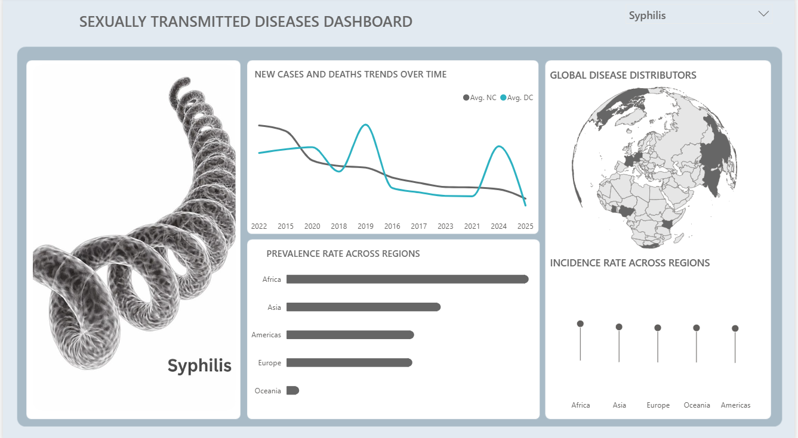
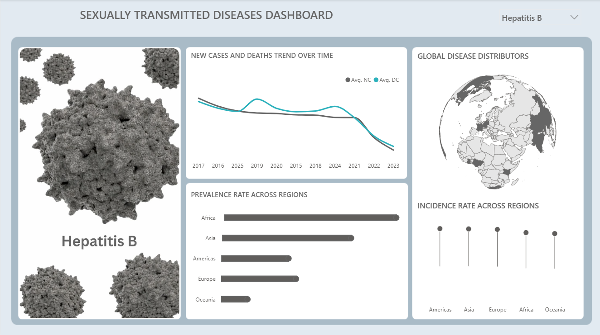
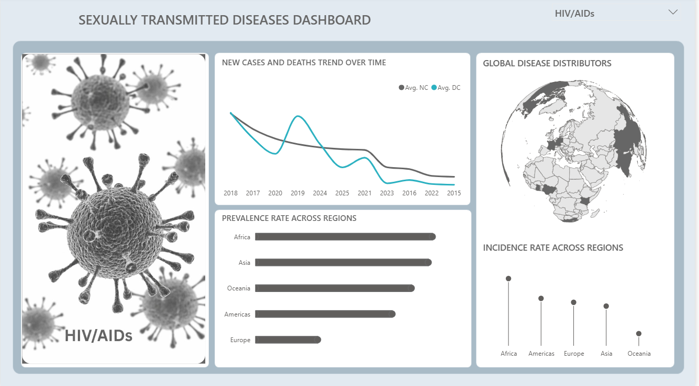
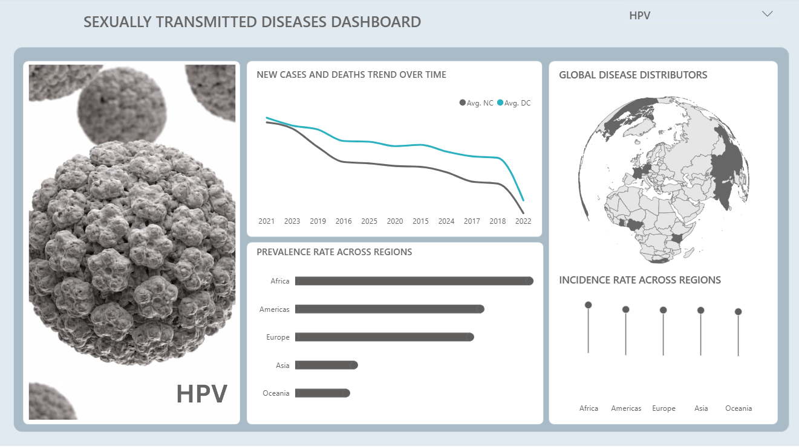

# STI-HEALTHCARE-ANALYTICS-DASHBOARD-
Healthcare data analytics project using Power BI to analyze STI trends, regional prevalence, incidence rates, and disease distribution.
# Sexually Transmitted Infections (STIs) Healthcare Analytics Dashboard

## Project Overview

This project is a healthcare data analytics dashboard designed to explore
patterns and regional distribution of selected sexually transmitted
infections (STIs), including Syphilis, Hepatitis B, HIV/AIDS, and HPV.

The dashboard combines trend analysis, regional prevalence, incidence
patterns, and geographical distribution to provide a visual overview of
the burden of these diseases across different regions.

The goal of the project is to demonstrate how healthcare data can be
transformed into meaningful insights that can support public health
monitoring, resource allocation, screening strategies, and disease
prevention planning.

## Diseases Covered

- Syphilis
- Hepatitis B
- HIV/AIDS
- Human Papillomavirus (HPV)

## Dashboard Preview

### Syphilis

### Hepatitis B

### HIV/AIDS

### HPV

## Key Areas Analysed

### 1. New Cases and Death Trends
The dashboard tracks changes in reported new cases and deaths over time,
allowing users to identify periods of increases, decreases, and unusual
changes that may require further investigation.

### 2. Prevalence Across Regions
Regional prevalence comparisons help identify areas with relatively
higher disease burden and provide a basis for further investigation into
possible differences in exposure, prevention, screening, healthcare
access, and treatment.

### 3. Incidence Across Regions
Incidence analysis provides insight into the occurrence of new cases
across geographical regions and can help public health stakeholders
monitor where transmission may be occurring at higher levels.

### 4. Geographical Distribution
The geographical visualisation provides a global view of where the
selected diseases are more prevalent, making regional patterns easier
to identify.

## Healthcare Perspective

STIs represent an important public health issue because many infections
can occur without obvious symptoms. Untreated infections can contribute
to complications affecting sexual and reproductive health, while some
viral STIs have long-term consequences.

For example, HPV is associated with cervical and other cancers, while
chronic Hepatitis B can contribute to cirrhosis and liver cancer. WHO
also reports that vaccines are available for Hepatitis B and HPV,
making prevention and vaccination important components of public health
strategies.

Therefore, analysing disease prevalence, incidence, and trends can help
healthcare stakeholders identify areas that may require increased
screening, prevention programmes, vaccination efforts, health education,
and healthcare resources.

## Analytical Questions

This project was developed around questions such as:

- How do new cases and deaths change over time?
- Which regions show higher prevalence?
- How does incidence vary across regions?
- Are there noticeable differences in disease distribution?
- Which areas may require further public health investigation?
- How can healthcare data support prevention and resource planning?

## Tools Used

- Power BI
- Data Cleaning & Transformation
- Data Visualization
- DAX
- Healthcare Data Analysis
- Geographic Analysis

## Key Skills Demonstrated

- Data cleaning and preparation
- Exploratory data analysis
- KPI and metric development
- Trend analysis
- Regional comparison
- Data visualization
- Dashboard design
- Healthcare analytics
- Insight generation
- Data storytelling

## Important Note

This dashboard is intended for analytical and educational purposes.
The visualizations describe patterns within the dataset and should not
be interpreted as clinical diagnoses or direct evidence of causation.

Regional differences should be investigated alongside factors such as
population size, testing coverage, reporting practices, healthcare
access, vaccination coverage, and other relevant epidemiological
factors.

